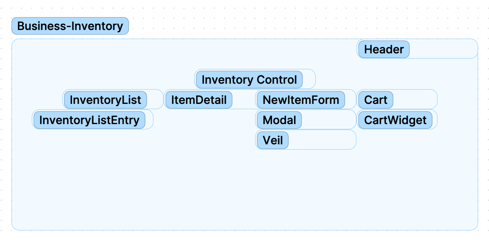

#  Local Business Inventory Tracker

#### By Vera Weikel 

#### This is a project to build Basic Web Application using ReactJS.

## Technologies Used

* React
* JSX
* Javascript
* CSS

## Goals/Objectives

An application in React that tracks inventory for a local business.

## Description

For any given inventory item, there will be tracking how much of it is remaining as it gets sold or given away. 

My local cafe operates as such: 

At our coffee shop, we sell coffee beans in 1-pound servings, and we get our coffee delivered in large burlap sacks. Here are the details:

* we sell multiple types of coffee beans, each in different burlap sacks
* one burlap sack contains 130 pounds of coffee beans
* every sale decrements one pound of coffee beans from the burlap sack, until it is empty

## Component Architecture

## How To Run This Project

1. Clone this repo.
2. Open the terminal and navigate to this project's production directory called "FarmersMarket".
3. In your terminal type $ npm run start

## Known Bugs

* None

## License

MIT License

Permission is hereby granted, free of charge, to any person obtaining a copy
of this software and associated documentation files (the "Software"), to deal
in the Software without restriction, including without limitation the rights
to use, copy, modify, merge, publish, distribute, sublicense, and/or sell
copies of the Software, and to permit persons to whom the Software is
furnished to do so, subject to the following conditions:

The above copyright notice and this permission notice shall be included in all
copies or substantial portions of the Software.

THE SOFTWARE IS PROVIDED "AS IS", WITHOUT WARRANTY OF ANY KIND, EXPRESS OR
IMPLIED, INCLUDING BUT NOT LIMITED TO THE WARRANTIES OF MERCHANTABILITY,
FITNESS FOR A PARTICULAR PURPOSE AND NONINFRINGEMENT. IN NO EVENT SHALL THE
AUTHORS OR COPYRIGHT HOLDERS BE LIABLE FOR ANY CLAIM, DAMAGES OR OTHER
LIABILITY, WHETHER IN AN ACTION OF CONTRACT, TORT OR OTHERWISE, ARISING FROM,
OUT OF OR IN CONNECTION WITH THE SOFTWARE OR THE USE OR OTHER DEALINGS IN THE
SOFTWARE.

Copyright (c) 2023 By Vera Weikel 

